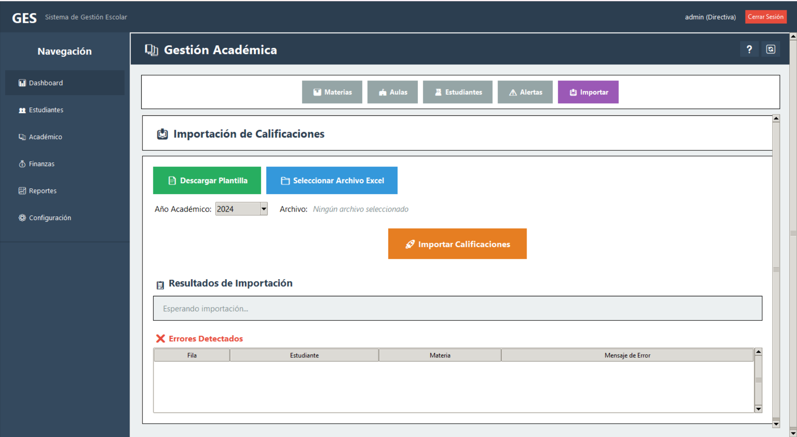

 
# GES — Sistema de Gestión Escolar
 

 
GES es un sistema de gestión escolar diseñado específicamente para centros educativos en Guinea Ecuatorial. Funciona completamente offline y en redes locales, sin necesidad de conexión a internet, adaptado a las condiciones tecnológicas y monetarias del contexto local (Franco CFA).
 
El proyecto nace de la necesidad de reducir la brecha tecnológica en Guinea Ecuatorial mediante herramientas digitales construidas localmente, para las personas de aquí.
 
---
 
## ¿Qué hace GES?
 
GES centraliza la gestión académica y financiera de un centro educativo en una sola aplicación de escritorio:
 
- Registro y seguimiento de estudiantes con matrícula automática
- Organización académica por niveles, grados y aulas
- Importación de notas desde Excel
- Gestión de pagos y calendarios de cuotas por tutor
- Generación de reportes PDF (boletines, morosidad, rendimiento)
- Modo red local para uso desde múltiples equipos
 
---
 
## Autor
 
Desarrollado por **Luis Rafael Eyoma** — [luisrafael.netlify.app](https://luisrafael.netlify.app)  
Xenon.py · Bata, Guinea Ecuatorial
 
---
 
## Licencia
 
Este proyecto está bajo la licencia MIT.