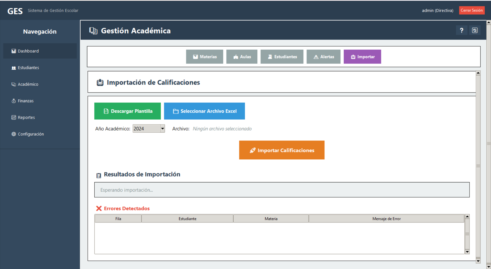

# GES — Sistema de Gestión Escolar


GES es un sistema de gestión escolar diseñado específicamente para centros educativos en Guinea Ecuatorial. Funciona completamente offline y en redes locales, sin necesidad de conexión a internet, adaptado a las condiciones tecnológicas y monetarias del contexto local (Franco CFA).

El proyecto nace de la necesidad de reducir la brecha tecnológica en Guinea Ecuatorial mediante herramientas digitales construidas localmente, para las personas de aquí.

---

## 🚀 Estado Actual del Proyecto

**Fase**: Corrección de Bugs Críticos Completada  
**Última Actualización**: Mayo 2026  
**Arquitectura**: Híbrida (Desktop + API REST + Cliente Remoto)

### ✅ Funcionalidades Implementadas
- **Gestión de Estudiantes**: CRUD completo con validaciones
- **Estructura Académica**: Niveles, grados, aulas y materias
- **Sistema Financiero**: Pagos, cuotas y calendarios de pago
- **Importación Excel**: Carga masiva de estudiantes con validación
- **Reportes PDF**: Boletines, morosidad y rendimiento académico
- **Modos de Operación**: Local, Servidor LAN, Cliente Remoto
- **Dashboard**: Métricas académicas y financieras en tiempo real

### 🔧 Correcciones Recientes (Mayo 2026)
- ✅ Campo "Nivel" obligatorio agregado a estudiantes
- ✅ Errores Tkinter (TclError) corregidos
- ✅ Selección de estudiantes en módulo financiero arreglada
- ✅ Precios de matrícula inicializados por nivel
- ✅ Ventana de calendario redimensionada
- ✅ Importación Excel completa con validación de nivel
- ✅ Validación de sintaxis completa (0 errores)

---

## 📋 Tabla de Contenidos

1. [¿Qué hace GES?](#-qué-hace-ges)
2. [Arquitectura del Sistema](#-arquitectura-del-sistema)
3. [Instalación y Configuración](#-instalación-y-configuración)
4. [Uso del Sistema](#-uso-del-sistema)
5. [Documentación Técnica](#-documentación-técnica)
6. [Desarrollo y Contribución](#-desarrollo-y-contribución)
7. [Autor](#-autor)
8. [Licencia](#-licencia)

---

## 🎯 ¿Qué hace GES?

GES centraliza la gestión académica y financiera de un centro educativo en una sola aplicación de escritorio:

### Gestión Académica
- **Registro de Estudiantes**: Matrícula automática con campos obligatorios (Nombre, Apellido, Nivel, Curso, Aula, Turno)
- **Estructura Académica**: Organización jerárquica por niveles educativos
- **Importación Masiva**: Carga de estudiantes desde archivos Excel con validación automática
- **Seguimiento de Calificaciones**: Registro de notas por trimestre y materia

### Gestión Financiera
- **Sistema de Pagos**: Registro de pagos con cálculo automático de deuda
- **Calendarios de Cuotas**: Generación automática de calendarios de pago
- **Precios por Nivel**: Matrícula diferenciada (Preescolar: 50k, Primaria: 75k, etc.)
- **Reportes de Morosidad**: Identificación automática de estudiantes con pagos pendientes

### Reportes y Analytics
- **Dashboard Interactivo**: Métricas en tiempo real del rendimiento académico y financiero
- **Reportes PDF**: Boletines de calificaciones, reportes de morosidad, análisis de rendimiento
- **Exportación Excel**: Datos exportables para análisis externos

### Arquitectura Flexible
- **Modo Standalone**: Funcionamiento completamente local
- **Modo Servidor**: API REST para acceso desde múltiples equipos en red local
- **Modo Cliente**: Conexión a servidor remoto manteniendo interfaz desktop

---

## 🏗️ Arquitectura del Sistema

### Patrón Arquitectónico
```
UI Layer (Tkinter) ← Service Layer ← Repository Layer ← SQLite Database
```

### Modos de Operación
| Modo | Descripción | Caso de Uso |
|------|-------------|-------------|
| **Desktop Local** | Aplicación standalone | Escuela pequeña, uso individual |
| **Servidor LAN** | API REST + Base de datos centralizada | Múltiples usuarios en red local |
| **Cliente Remoto** | Desktop conectado a servidor | Estaciones de trabajo conectadas |

### Tecnologías Principales
- **Backend**: Python 3.11+ con SQLite
- **UI**: Tkinter (nativo, sin dependencias externas)
- **API**: FastAPI + Uvicorn para modo servidor
- **Procesamiento**: OpenPyXL (Excel), ReportLab (PDF)
- **Validación**: Pydantic para esquemas de datos

---

## 📦 Instalación y Configuración

### Prerrequisitos
- Python 3.11 o superior
- Windows 10/11 (optimizado para este SO)
- 2GB RAM mínimo, 4GB recomendado
- 500MB espacio en disco

### Instalación Rápida
```bash
# Clonar repositorio
git clone <repository-url>
cd ges_proy

# Crear entorno virtual
python -m venv .venv
.venv\Scripts\activate

# Instalar dependencias
pip install -r requirements.txt

# Ejecutar aplicación
python main.py
```

### Configuración de Modos
Editar `config.json` para seleccionar modo de operación:
```json
{
  "mode": "normal",  // "normal", "server", "client"
  "server_host": "localhost",
  "server_port": 8000
}
```

---

## 💻 Uso del Sistema

### Primeros Pasos
1. **Ejecutar la aplicación**: `python main.py`
2. **Login inicial**: Usuario por defecto (configurar en settings)
3. **Configurar estructura académica**: Crear niveles, grados y aulas
4. **Importar estudiantes**: Usar módulo de importación Excel
5. **Configurar precios**: Establecer matrícula por nivel educativo

### Flujo de Trabajo Típico
1. **Importación inicial**: Cargar estudiantes desde Excel
2. **Registro de pagos**: Matrícula y cuotas iniciales
3. **Gestión académica**: Registro de calificaciones
4. **Reportes**: Generación de boletines y análisis

### Importación Excel
- **Formato requerido**: Archivo .xlsx con columnas específicas
- **Campos obligatorios**: nombre, apellido, nivel, curso, aula, turno, año_escolar
- **Validación automática**: Mapeo inteligente de columnas con aliases
- **Vista previa**: Revisión de datos antes de importar

---

## 📚 Documentación Técnica

### Arquitectura y Diseño
- **[ARQUITECTURA_GES.md](docs/arquitecture/ARQUITECTURA_GES.md)**: Análisis completo de la arquitectura híbrida
- **[modulo_importacion_estudiantes.md](docs/arquitecture/modulo_importacion_estudiantes.md)**: Detalles del módulo de importación Excel
- **[decisions_import_module.md](docs/decisions/decisions_import_module.md)**: Decisiones arquitecturales tomadas

### Proceso de Desarrollo
- **[proceso_desarrollo.md](docs/proceso_desarrollo.md)**: Cronología completa del desarrollo
- **[roadmap_current_phase.md](docs/roadmap/roadmap_current_phase.md)**: Estado actual y próximos pasos

### Estructura del Código
```
ges_proy/
├── api/           # API REST (FastAPI)
├── ui/            # Interfaz Tkinter
├── services/      # Lógica de negocio
├── database/      # Acceso a datos
├── utils/         # Utilidades (Excel, helpers)
├── tests/         # Suite de pruebas
└── docs/          # Documentación completa
```

---

## 🔧 Desarrollo y Contribución

### Configuración de Desarrollo
```bash
# Instalar dependencias de desarrollo
pip install -r requirements-dev.txt

# Ejecutar tests
python -m pytest tests/

# Validación de sintaxis
python -m py_compile main.py
```

### Guías de Contribución
- Seguir PEP 8 para estilo de código
- Usar type hints en funciones nuevas
- Agregar docstrings descriptivos
- Crear tests para nuevas funcionalidades
- Actualizar documentación con cambios

### Estructura de Commits
```
feat: nueva funcionalidad
fix: corrección de bug
docs: cambios en documentación
refactor: mejora de código sin cambiar funcionalidad
test: agregar o modificar tests
```

---

## 👨‍💻 Autor

**Luis Rafael Eyoma** — Desarrollador Full-Stack  
[Xenon.py](https://xenon-py.vercel.app) · Bata, Guinea Ecuatorial  
[Portfolio](https://luisrafael.netlify.app) | [LinkedIn](https://linkedin.com/in/luisrafaeleyoma)

---

## 📄 Licencia

Este proyecto está bajo la licencia MIT. Ver archivo [LICENSE](LICENSE) para más detalles.

---

## 🙏 Agradecimientos

- Comunidad Python de Guinea Ecuatorial
- Instituciones educativas que colaboraron en los requerimientos
- Open source community por las librerías utilizadas

---

*Última actualización: Mayo 2026*