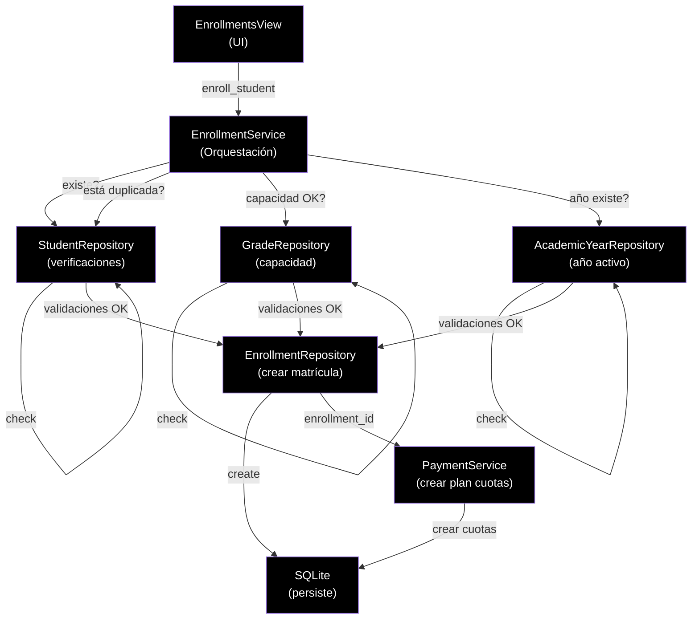
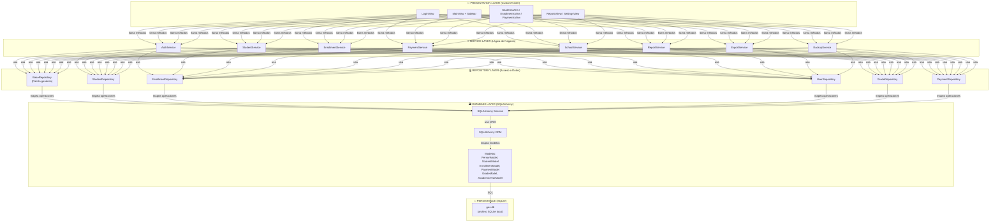
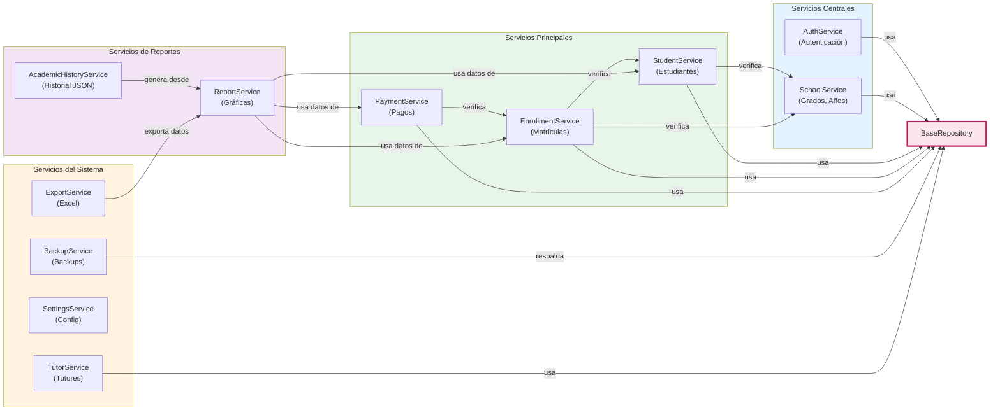
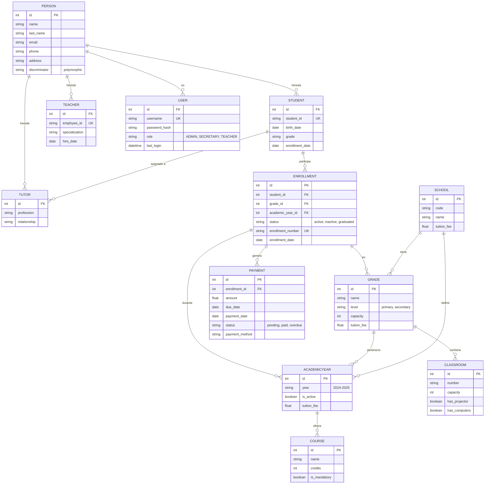
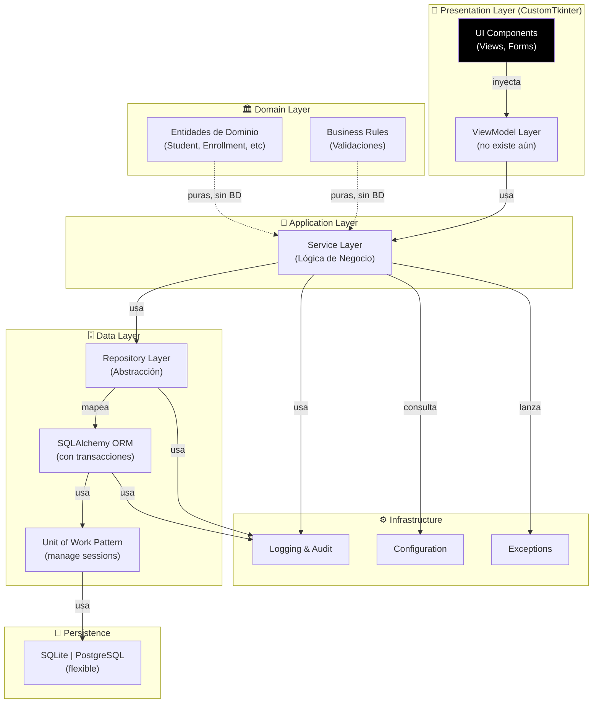

# 🏗️ ARQUITECTURA DEL SISTEMA GES (Gestión Escolar)

**Documento de Análisis Arquitectónico**  
**Generado:** Mayo 2026  
**Estado del Proyecto:** En Desarrollo Activo (MVP funcional)

---

## 📋 Tabla de Contenidos

1. [Resumen Ejecutivo](#resumen-ejecutivo)
2. [Árbol Simplificado del Proyecto](#árbol-simplificado-del-proyecto)
3. [Diagrama Arquitectónico Principal](#diagrama-arquitectónico-principal)
4. [Diagramas Secundarios](#diagramas-secundarios)
5. [Relaciones Importantes](#relaciones-importantes)
6. [Riesgos Arquitectónicos](#riesgos-arquitectónicos)
7. [Propuestas de Mejora](#propuestas-de-mejora)

---

## 1. Resumen Ejecutivo

### Tipo de Arquitectura Detectada

**Arquitectura de Capas (Layered Architecture) + Repository Pattern**

GES implementa una arquitectura por capas bien definida, siguiendo los principios de **Clean Architecture**:

```
┌─────────────────────────────────────────┐
│  UI Layer (CustomTkinter Desktop)       │
├─────────────────────────────────────────┤
│  Service Layer (Lógica de Negocio)      │
├─────────────────────────────────────────┤
│  Repository Layer (Acceso a Datos)      │
├─────────────────────────────────────────┤
│  Database Layer (SQLAlchemy + SQLite)   │
└─────────────────────────────────────────┘
```

### Tecnologías Utilizadas

| Componente | Tecnología | Versión |
|-----------|-----------|---------|
| **Base de Datos** | SQLite + SQLAlchemy | 2.0.23 |
| **Interfaz Gráfica** | CustomTkinter | 5.2.1 |
| **Procesamiento de Datos** | Pandas | 2.1.4 |
| **Visualizaciones** | Matplotlib | 3.8.2 |
| **Excel** | OpenPyXL | 3.1.2 |
| **Lenguaje** | Python | 3.10+ |

### Patrón Arquitectónico

- ✅ **Layered/Clean Architecture:** Separación clara de responsabilidades
- ✅ **Repository Pattern:** Abstracción del acceso a datos
- ✅ **Dependency Injection:** Servicios con repositorios inyectados
- ✅ **MVC adaptado para Desktop:** UI capa de presentación, Servicios como controladores
- ✅ **Offline-First:** Todo funciona sin conexión de red

### Organización General del Proyecto

**Estructura Conceptual:**
- **Aplicación Monolítica en Desktop:** Una única aplicación Python con acceso local a SQLite
- **Modularidad por Dominio:** Cada dominio de negocio (estudiantes, matrículas, pagos, reportes) tiene su propio conjunto de servicios y repositorios
- **Configuración Centralizada:** Archivo `config/settings.json` para parámetros del sistema
- **Interfaz Centralizada:** Punto de entrada único mediante `main.py` → `LoginView` → `MainApplication`

---

## 2. Árbol Simplificado del Proyecto

```
ges_proy/                                   ← Raíz del proyecto
│
├── 📁 app/                                ← Aplicación principal (lógica)
│   ├── domain/                            → Entidades puras del dominio
│   │   └── entities.py                    → Modelos de dominio (sin BD)
│   │
│   ├── services/                          → Capa de servicios (lógica de negocio)
│   │   ├── auth_service.py               → Autenticación y seguridad
│   │   ├── student_service.py            → Gestión de estudiantes
│   │   ├── enrollment_service.py         → Matrículas con validaciones
│   │   ├── payment_service.py            → Pagos y cuotas
│   │   ├── school_service.py             → Grados y años académicos
│   │   ├── report_service.py             → Reportes y gráficas
│   │   ├── export_service.py             → Exportación a Excel
│   │   ├── backup_service.py             → Backups del sistema
│   │   ├── academic_history_service.py   → Historial académico JSON
│   │   ├── settings_service.py           → Configuración del sistema
│   │   └── tutor_service.py              → Gestión de tutores
│   │
│   ├── repositories/                      → Capa de acceso a datos
│   │   ├── base_repository.py            → CRUD genérico para todas entidades
│   │   ├── student_repository.py         → Acceso a datos de estudiantes
│   │   ├── enrollment_repository.py      → Acceso a matrículas
│   │   ├── user_repository.py            → Acceso a usuarios
│   │   ├── grade_repository.py           → Acceso a grados
│   │   ├── academic_year_repository.py   → Acceso a años académicos
│   │   └── school_repository.py          → Acceso a datos escolares
│   │
│   └── ui/                                → Capa de presentación (CustomTkinter)
│       ├── login_view.py                 → Ventana de autenticación
│       ├── main_view.py                  → Ventana principal con navegación
│       ├── sidebar.py                    → Menú lateral
│       ├── reports_view.py               → Panel de reportes
│       ├── settings_view.py              → Panel de configuración
│       │
│       ├── students/                     → Módulo gestión de estudiantes
│       │   ├── students_view.py          → Lista y búsqueda
│       │   └── student_form.py           → Formulario CRUD
│       │
│       ├── enrollments/                  → Módulo gestión de matrículas
│       │   ├── enrollments_view.py       → Lista de matrículas
│       │   ├── enrollment_form.py        → Formulario de matrícula
│       │   └── payments_view.py          → Gestión de pagos
│       │
│       ├── reports/                      → Módulo de reportes
│       │   ├── charts_view.py            → Gráficas (matplotlib)
│       │   └── history_view.py           → Historial académico
│       │
│       └── settings/                     → Módulo de configuración
│           ├── backup_view.py            → Backups
│           └── export_view.py            → Exportar a Excel
│
├── 📁 database/                          ← Capa de base de datos
│   ├── models.py                         → Modelos consolidados
│   ├── connection.py                     → Configuración de conexión
│   ├── db.py                             → Gestión de sesiones y operaciones DB
│   │
│   └── models/                           → Modelos SQLAlchemy (organizados por dominio)
│       ├── base.py                       → Clase base común
│       ├── person.py                     → PersonModel, StudentModel, TutorModel, TeacherModel
│       ├── school.py                     → SchoolModel, GradeModel, AcademicYearModel, CourseModel, ClassroomModel
│       └── enrollment.py                 → EnrollmentModel, PaymentModel
│
├── 📁 config/                            ← Configuración del sistema
│   └── settings.json                     → Parámetros del sistema (cuotas, capacidades, etc)
│
├── 📁 controllers/                       ← Controllers (estructura básica, evolución futura)
│   └── __init__.py
│
├── 📁 domain/                            ← Entidades de dominio legadas
│   └── entities.py                       → Modelos de dominio (duplica app/domain/)
│
├── 📁 services/                          ← Servicios legados
│   └── (coexisten con app/services/)    → Servicios heredados del diseño anterior
│
├── 📁 repositories/                      ← Repositorios legados
│   └── (coexisten con app/repositories/)→ Repositorios heredados
│
├── 📁 ui/                                ← UI legada
│   └── (coexisten con app/ui/)          → Componentes heredados
│
├── 📁 tests/                             ← Suite de pruebas
│   ├── test_services_flow.py             → Tests de flujo de servicios
│   ├── test_database.py                  → Tests de BD
│   ├── test_navigation.py                → Tests de navegación UI
│   └── test_structure.py                 → Tests de estructura
│
├── 📄 main.py                            ← 🔴 PUNTO DE ENTRADA PRINCIPAL
├── 📄 check_payments.py                  ← Utilidad para verificar pagos
├── 📄 requirements.txt                   ← Dependencias Python
└── 📄 README.md                          ← Documentación del proyecto
```

---

## 3. Diagrama Arquitectónico Principal

```mermaid
graph TB
    subgraph "👤 Capas de Usuario"

        A["🔐 Usuario del Sistema<br/>(Admin, Secretaria, Profesor)"]
    end
    
    subgraph "🎨 Presentation Layer - UI"
        A --> LoginView["LoginView<br/>(Autenticación)"]
        LoginView --> MainApp["MainApplication<br/>(Ventana Principal)"]
        MainApp --> Sidebar["Sidebar<br/>(Navegación)"]
        MainApp --> Content["Content Area<br/>(Vistas dinámicas)"]
        
        Content --> StudentsView["StudentsView"]
        Content --> EnrollmentsView["EnrollmentsView"]
        Content --> PaymentsView["PaymentsView"]
        Content --> ReportsView["ReportsView"]
        Content --> SettingsView["SettingsView"]
    end
    
    subgraph "💼 Service Layer - Lógica de Negocio"
    
        StudentsView --> StudentService["StudentService<br/>(CRUD estudiantes)"]
        EnrollmentsView --> EnrollmentService["EnrollmentService<br/>(Validaciones matrícula)"]
        PaymentsView --> PaymentService["PaymentService<br/>(Pagos y cuotas)"]
        ReportsView --> ReportService["ReportService<br/>(Análisis datos)"]
        SettingsView --> SettingsService["SettingsService<br/>(Configuración)"]
        
        LoginView --> AuthService["AuthService<br/>(Autenticación + Hash)"]
        
        StudentService --> SchoolService["SchoolService<br/>(Grados y años)"]
        EnrollmentService --> SchoolService
        ReportService --> AcademicHistoryService["AcademicHistoryService<br/>(Historial JSON)"]
        
        SettingsView --> ExportService["ExportService<br/>(Excel)"]
        SettingsView --> BackupService["BackupService<br/>(Backups)"]
    end
    
    subgraph "🗄️ Repository Layer - Acceso a Datos"
        StudentService --> BaseRepository["BaseRepository<br/>(CRUD genérico)"]
        EnrollmentService --> BaseRepository
        PaymentService --> BaseRepository
        AuthService --> BaseRepository
        SchoolService --> BaseRepository
        
        StudentService --> StudentRepository["StudentRepository<br/>(Búsquedas específicas)"]
        EnrollmentService --> EnrollmentRepository["EnrollmentRepository<br/>(Matrículas específicas)"]
        PaymentService --> PaymentRepository["PaymentRepository<br/>(Pagos específicos)"]
        AuthService --> UserRepository["UserRepository<br/>(Usuarios específicos)"]
    end
    
    subgraph "🗃️ Database Layer - SQLAlchemy + SQLite"
        BaseRepository --> SQLAlchemy["SQLAlchemy ORM"]
        StudentRepository --> SQLAlchemy
        EnrollmentRepository --> SQLAlchemy
        PaymentRepository --> SQLAlchemy
        UserRepository --> SQLAlchemy
        
        SQLAlchemy --> Models["Modelos de Base de Datos<br/>PersonModel, StudentModel, EnrollmentModel,<br/>PaymentModel, GradeModel, AcademicYearModel, etc"]
        
        Models --> SQLite["SQLite<br/>(base de datos local)"]
    end
    
    style A fill: #000000
    style LoginView fill: #00000
    style MainApp fill: #000000
    style Content fill: #000000
    style StudentService fill: #000000
    style EnrollmentService fill: #000000
    style PaymentService fill: #000000
    style AuthService fill: #000000
    style BaseRepository fill: #000000
    style SQLAlchemy fill: #000000
    style SQLite fill: #000000
```



### 📍 Descripción del Flujo Principal

**Ejemplo: Usuario crea una nueva matrícula**

1. **UI Layer:** Usuario hace clic en "Nueva Matrícula" en `EnrollmentsView`
2. **Service Layer:** Se invoca `EnrollmentService.enroll_student()`
   - ✔️ Valida que el estudiante exista
   - ✔️ Valida que el grado exista
   - ✔️ Valida que no esté duplicada en el año
   - ✔️ Valida capacidad del grado
3. **Repository Layer:** `EnrollmentRepository.create(EnrollmentModel)` → acceso a datos
4. **Database Layer:** SQLAlchemy guarda en SQLite
5. **Response:** El resultado se devuelve a la UI para mostrar feedback al usuario

---

## 4. Diagramas Secundarios

### 4.1 Flujo de Autenticación

```mermaid
graph LR
    A["LoginView<br/>(UI)"]
    B["AuthService<br/>(validar credenciales)"]
    C["UserRepository<br/>(buscar usuario)"]
    D["SQLite<br/>(personas tabla)"]
    E["Hash SHA-256"]
    F["MainApplication<br/>(autenticado)"]
    
    A -->|username + password| B
    B -->|calcula hash| E
    E -->|hash + username| C
    C -->|query| D
    D -->|usuario + hash| C
    C -->|valida| B
    B -->|update last_login| D
    B -->|on_login_success| F
    
    style A fill: #000000
    style B fill: #000000
    style C fill: #000000
    style D fill: #000000
    style E fill: #000000
    style F fill: #000000
```



**Seguridad:**
- ✅ Contraseñas hasheadas con SHA-256
- ✅ Validación de mínimo 6 caracteres
- ✅ Registro de último login
- ✅ Verificación de estado activo del usuario

---

### 4.2 Flujo de Matrículas (Enrollments)



**Reglas de Negocio Validadas:**
- ✅ Estudiante no puede matricularse dos veces en mismo año
- ✅ El grado no debe superar capacidad máxima
- ✅ El estudiante debe existir en el sistema
- ✅ El año académico debe estar activo

---

### 4.3 Arquitectura de Capas Detallada



---

### 4.4 Dependencias entre Servicios



---

### 4.5 Estructura de Datos (Modelos)



---

## 5. Relaciones Importantes

### 5.1 Dependencias Críticas

| Módulo | Depende De | Criticidad | Razón |
|--------|-----------|-----------|-------|
| **EnrollmentService** | StudentRepository, GradeRepository, AcademicYearRepository | 🔴 CRÍTICA | Valida todas las reglas de matrícula |
| **PaymentService** | EnrollmentRepository | 🔴 CRÍTICA | Sin matrículas no hay pagos |
| **ReportService** | StudentRepository, EnrollmentRepository, PaymentRepository | 🔴 CRÍTICA | Genera análisis del sistema |
| **AuthService** | UserRepository | 🔴 CRÍTICA | Controla acceso a la aplicación |
| **MainApplication** | AuthService | 🔴 CRÍTICA | Punto de entrada, requiere autenticación |
| **SchoolService** | GradeRepository, AcademicYearRepository | 🟡 IMPORTANTE | Datos maestros del sistema |
| **StudentService** | StudentRepository, TutorRepository | 🟡 IMPORTANTE | CRUD de estudiantes |
| **BackupService** | Todas las tablas | 🟡 IMPORTANTE | Respalda todos los datos |
| **ExportService** | ReportService | 🟢 SECUNDARIA | Opcional, genera reportes Excel |

### 5.2 Módulos Críticos

```
Módulos que si fallan, la aplicación NO funciona:

1. database/db.py              → Gestión de sesiones y conexión
2. AuthService                 → No se puede usar la aplicación
3. BaseRepository              → No se puede acceder a datos
4. database/models/*           → Mapeo a la BD
5. MainApplication             → Punto de entrada principal
```

### 5.3 Módulos Reutilizados

| Módulo | Usado Por | Veces |
|--------|----------|-------|
| **BaseRepository** | Todos los repositorios específicos | 7x |
| **SQLAlchemy Session** | Todos los repositorios | 7x+ |
| **database.db** | Todos los servicios | 11x+ |
| **PersonModel** | StudentModel, TutorModel, TeacherModel, UserModel | 4x |

### 5.4 Posibles Cuellos de Botella

1. **SQLite Local:** A medida que crece la base de datos (miles de registros), las queries pueden volverse lentas
   - **Impacto:** ReportService y búsquedas en Students
   - **Solución:** Indexar campos críticos, migrar a PostgreSQL si escala

2. **Generación de Reportes (Matplotlib):** Puede ser lenta con muchos datos
   - **Impacto:** ReportService.generate_charts()
   - **Solución:** Caché de reportes, generación asíncrona

3. **UI Responsiva:** CustomTkinter puede quedar bloqueada durante operaciones largas
   - **Impacto:** Backup, Export, Reportes
   - **Solución:** Threading para operaciones largas

4. **Concurrencia:** SQLite no soporta escritura concurrente
   - **Impacto:** Si múltiples usuarios acceden simultáneamente
   - **Solución:** Migrar a PostgreSQL, agregar control de concurrencia

---

## 6. Riesgos Arquitectónicos

### 6.1 Problemas Detectados

#### 🔴 CRÍTICO

**1. Código Duplicado entre `app/` y raíz**

```
Existe en DOS ubicaciones:
├── app/domain/entities.py        ← Nueva estructura (correcta)
├── domain/entities.py            ← Estructura legada (DUPLICADA)

├── app/repositories/             ← Repositorios nuevos (correcta)
├── repositories/                 ← Repositorios legados (DUPLICADA)

├── app/services/                 ← Servicios nuevos (correcta)
├── services/                     ← Servicios legados (DUPLICADA)

├── app/ui/                       ← UI nueva (correcta)
├── ui/                           ← UI legada (DUPLICADA)
```

**Impacto:** 
- Confusión sobre qué código usar
- Actualizaciones en un lugar no se replican
- Mantenimiento duplicado

**Severidad:** 🔴 CRÍTICA

---

#### 🔴 CRÍTICO

**2. Mezcla de Modelos de Dominio**

`app/domain/entities.py` es ignorado en favor de modelos SQLAlchemy directos.

```python
# app/domain/entities.py (DEFINIDO pero NO USADO)
class Student:
    pass

# Pero en services se usa:
from database.models.person import StudentModel  # Modelo de BD, no dominio puro
```

**Impacto:**
- Violación de principios de arquitectura
- Modelos SQLAlchemy mezclados con lógica de negocio
- Difícil de testear

**Severidad:** 🔴 CRÍTICA

---

#### 🟡 IMPORTANTE

**3. Falta de Validaciones en Repositorios**

Las reglas de negocio están en Servicios, pero es fácil crear registros inválidos accediendo directamente a repositorios.

```python
# ❌ Esto debería ser bloqueado pero no lo está:
enrollment_repo.create(EnrollmentModel(
    student_id=999,  # Estudiante inexistente
    grade_id=999,    # Grado inexistente
))
```

**Impacto:**
- Datos inconsistentes si se ataca la API
- Base de datos con registros huérfanos

**Severidad:** 🟡 IMPORTANTE

---

#### 🟡 IMPORTANTE

**4. Sin Transacciones Explícitas**

Las operaciones complejas no usan transacciones. Si algo falla a mitad, la BD queda en estado inconsistente.

```python
# ❌ Si falla después del create, los pagos no se crean:
def enroll_student(...):
    enrollment = enrollment_repo.create(enrollment_model)  # ✅
    payment_service.create_payment_schedule(enrollment.id)  # ❌ Si falla aquí...
```

**Impacto:**
- Matrículas sin cuotas asociadas
- Datos incompletos en la BD

**Severidad:** 🟡 IMPORTANTE

---

#### 🟡 IMPORTANTE

**5. Sin Control de Concurrencia**

SQLite bloquea escrituras. Múltiples usuarios pueden ver datos obsoletos.

```python
# Usuario A lee: enrollment.status = 'pending'
# Usuario B actualiza: enrollment.status = 'paid'
# Usuario A guardó datos basado en estado obsoleto
```

**Impacto:**
- Corrupción de datos bajo concurrencia
- Sobrescrituras de cambios recientes

**Severidad:** 🟡 IMPORTANTE

---

#### 🟢 MODERADO

**6. UI Bloqueante**

Operaciones largas (reportes, backups) congelan la interfaz.

```python
# ❌ La UI se congela mientras se genera el reporte:
def generate_report(self):
    data = report_service.generate_charts()  # 10 segundos...
    # UI no responde
```

**Impacto:**
- Mala experiencia de usuario
- Usuario piensa que aplicación se colgó

**Severidad:** 🟢 MODERADO

---

#### 🟢 MODERADO

**7. Configuración Hardcodeada**

Capacidades, cuotas y parámetros en código, no en configuración.

```python
# ❌ En EnrollmentService:
if len(enrollments) >= 30:  # 🔥 Capacidad hardcodeada

# ✅ Debería venir de:
if len(enrollments) >= grade.capacity  # Bien
```

**Impacto:**
- Cambiar parámetros requiere editar código
- Diferente para cada escuela no escalable

**Severidad:** 🟢 MODERADO

---

#### 🟢 MODERADO

**8. Sin Logging ni Auditoría**

No hay registro de quién cambió qué y cuándo.

```python
# ❌ Cambios sin auditoría:
student.status = 'inactive'
session.commit()  # ¿Quién lo hizo? ¿Cuándo? ¿Por qué?
```

**Impacto:**
- Imposible investigar cambios incorrectos
- Cumplimiento regulatorio débil

**Severidad:** 🟢 MODERADO

---

#### 🟢 MODERADO

**9. Gestor de Dependencias Débil**

Servicios crean sus propias instancias de repositorios. No hay inyección real.

```python
class EnrollmentService:
    def __init__(self):
        self.enrollment_repo = EnrollmentRepository()  # Creada aquí
        self.student_repo = StudentRepository()
```

**Impacto:**
- Difícil de mockear para tests
- Acoplamiento fuerte

**Severidad:** 🟢 MODERADO

---

### 6.2 Resumen de Riesgos

| Riesgo | Severidad | Estado |
|--------|-----------|--------|
| Código duplicado (app/ vs raíz) | 🔴 CRÍTICA | Activo |
| Modelos de dominio ignorados | 🔴 CRÍTICA | Activo |
| Falta de validaciones en Repos | 🟡 IMPORTANTE | Activo |
| Sin transacciones explícitas | 🟡 IMPORTANTE | Activo |
| Sin control de concurrencia | 🟡 IMPORTANTE | Potencial |
| UI bloqueante en ops largas | 🟢 MODERADO | Activo |
| Configuración hardcodeada | 🟢 MODERADO | Activo |
| Sin logging/auditoría | 🟢 MODERADO | Activo |
| Inyección débil de dependencias | 🟢 MODERADO | Activo |

---

## 7. Propuestas de Mejora

### 7.1 Plan de Refactorización Recomendado

#### **Fase 1: Limpieza de Código (URGENTE)**

**1. Eliminar Duplicación**

```
├── app/
│   ├── domain/entities.py         ← Mantener y usar
│   ├── repositories/              ← Mantener y usar
│   ├── services/                  ← Mantener y usar
│   └── ui/                        ← Mantener y usar
│
├── domain/                        ← ELIMINAR
├── repositories/                  ← ELIMINAR
├── services/                      ← ELIMINAR
├── ui/                            ← ELIMINAR
└── controllers/                   ← ELIMINAR o CONSOLIDAR
```

**Acciones:**
- ✅ Mover todo a `app/`
- ✅ Actualizar imports en main.py
- ✅ Eliminar duplicados
- ✅ Tests de smoke para verificar

**Tiempo:** 2-3 horas

---

**2. Usar Entidades de Dominio**

```python
# ❌ Actual (SQLAlchemy Model)
from database.models.person import StudentModel

# ✅ Futuro (Entidad de Dominio)
from app.domain.entities import Student
from app.repositories.student_repository import StudentRepository

# En servicio:
class StudentService:
    def create_student(self, student_data: dict) -> Student:
        # Valida con entidad de dominio
        student = Student(**student_data)
        # Guarda usando repositorio
        return self.student_repo.create(student)
```

**Impacto:** Arquitectura más limpia, fácil testing

**Tiempo:** 4-6 horas

---

#### **Fase 2: Robustez (IMPORTANTE)**

**3. Agregar Transacciones Explícitas**

```python
# Antes: ❌
def enroll_student(self, student_id, grade_id, academic_year_id):
    enrollment = enrollment_repo.create(...)
    payment_service.create_schedule(enrollment.id)

# Después: ✅
from sqlalchemy import begin_nested

def enroll_student(self, student_id, grade_id, academic_year_id):
    with db.session.begin_nested():
        try:
            enrollment = enrollment_repo.create(...)
            payment_service.create_schedule(enrollment.id)
            return enrollment
        except Exception as e:
            # Rollback automático
            raise EnrollmentError(f"Fallo la matrícula: {e}")
```

**Impacto:** Datos consistentes

**Tiempo:** 3-4 horas

---

**4. Agregar Validaciones en Repositorios**

```python
# Antes: ❌
class BaseRepository:
    def create(self, model):
        session.add(model)
        session.commit()

# Después: ✅
class BaseRepository:
    def create(self, model):
        self._validate(model)  # Validar antes
        session.add(model)
        session.commit()
        
    def _validate(self, model):
        # Validar restricciones de integridad
        pass
```

**Impacto:** Imposible crear datos inválidos

**Tiempo:** 2-3 horas

---

**5. Agregar Logging y Auditoría**

```python
import logging

class AuditService:
    @staticmethod
    def log_change(user_id, entity, action, old_value, new_value):
        logging.info(f"Usuario {user_id} {action} {entity}: {old_value} → {new_value}")

# En servicios:
def update_student(self, student_id, data):
    old_student = student_repo.get_by_id(student_id)
    new_student = student_repo.update(student_id, data)
    AuditService.log_change(self.user_id, "Student", "UPDATE", old_student, new_student)
```

**Impacto:** Auditoría completa de cambios

**Tiempo:** 2-3 horas

---

#### **Fase 3: Escalabilidad (FUTURA)**

**6. Threading para Operaciones Largas**

```python
import threading
import queue

class ReportService:
    def __init__(self):
        self.report_queue = queue.Queue()
    
    def generate_charts_async(self, on_complete):
        def worker():
            charts = self._generate_charts_internal()
            on_complete(charts)
        
        thread = threading.Thread(target=worker, daemon=True)
        thread.start()

# En UI:
def on_generate_reports(self):
    report_service.generate_charts_async(
        on_complete=self.display_charts
    )
```

**Impacto:** UI responsiva

**Tiempo:** 3-4 horas

---

**7. Inyección de Dependencias**

```python
# Antes: ❌
class StudentService:
    def __init__(self):
        self.repo = StudentRepository()

# Después: ✅ (con patrón simple, sin framework)
class StudentService:
    def __init__(self, student_repo: StudentRepository):
        self.repo = student_repo

# En main:
student_repo = StudentRepository()
student_service = StudentService(student_repo)
```

**Impacto:** Fácil testing, desacoplamiento

**Tiempo:** 2-3 horas

---

### 7.2 Arquitectura Mejorada Propuesta



---

### 7.3 Nuevo Diagrama: Vista de Componentes Mejorada

```mermaid
graph TB
    subgraph "UI (Presentation)"
        UI1["LoginView"]
        UI2["MainView"]
        UI3["Components"]
    end
    
    subgraph "ViewModel (New)"
        VM1["StudentViewModel"]
        VM2["EnrollmentViewModel"]
        VM3["ReportViewModel"]
    end
    
    subgraph "Services (Application)"
        S1["StudentService"]
        S2["EnrollmentService"]
        S3["PaymentService"]
        S4["ReportService"]
    end
    
    subgraph "Repositories (Data Access)"
        R1["StudentRepository"]
        R2["EnrollmentRepository"]
        R3["PaymentRepository"]
    end
    
    subgraph "Domain (Business Logic)"
        D1["Student Entity"]
        D2["Enrollment Entity"]
        D3["Payment Entity"]
        D4["Validation Rules"]
    end
    
    subgraph "Infrastructure"
        DB["Database<br/>(SQLite/PostgreSQL)"]
        LOG["Logging Service"]
        CONFIG["Config Service"]
        AUDIT["Audit Service"]
    end
    
    UI1 & UI2 & UI3 -->|usa| VM1 & VM2 & VM3
    VM1 & VM2 & VM3 -->|invoca| S1 & S2 & S3 & S4
    S1 & S2 & S3 & S4 -->|crea/valida| D1 & D2 & D3 & D4
    S1 & S2 & S3 & S4 -->|usa| R1 & R2 & R3
    R1 & R2 & R3 -->|persiste| D1 & D2 & D3
    R1 & R2 & R3 -->|accede| DB
    S1 & S2 & S3 & S4 -->|registra| LOG & AUDIT
    S1 & S2 & S3 & S4 -->|consulta| CONFIG
    
    style UI1 fill:#fff3e0
    style UI2 fill:#fff3e0
    style UI3 fill:#fff3e0
    style VM1 fill:#fff9c4
    style VM2 fill:#fff9c4
    style VM3 fill:#fff9c4
    style S1 fill:#e8f5e9
    style S2 fill:#e8f5e9
    style S3 fill:#e8f5e9
    style S4 fill:#e8f5e9
    style D1 fill:#e3f2fd
    style D2 fill:#e3f2fd
    style D3 fill:#e3f2fd
    style D4 fill:#e3f2fd
    style R1 fill:#fce4ec
    style R2 fill:#fce4ec
    style R3 fill:#fce4ec
    style DB fill:#ffccbc
    style LOG fill:#f3e5f5
    style AUDIT fill:#f3e5f5
    style CONFIG fill:#f3e5f5
```



---

## 8. Checklist de Implementación

### Corto Plazo (1-2 semanas)

- [ ] Eliminar código duplicado entre `app/` y raíz
- [ ] Actualizar todos los imports en `main.py` y archivos de prueba
- [ ] Agregar transacciones explícitas en operaciones complejas
- [ ] Agregar logging básico en servicios
- [ ] Tests de humo (smoke tests) para verificar que nada rompió

### Mediano Plazo (2-4 semanas)

- [ ] Implementar validaciones en repositorios
- [ ] Agregar auditoría de cambios
- [ ] Usar entidades de dominio en lugar de modelos SQLAlchemy directos
- [ ] Agregar threading para operaciones largas
- [ ] Tests unitarios para servicios críticos

### Largo Plazo (1-2 meses)

- [ ] Inyección de dependencias formal
- [ ] Agregar capa ViewModel
- [ ] Considerar migración a PostgreSQL si escala
- [ ] Agregar API REST (si necesita múltiples clientes)
- [ ] Tests de integración completos

---

## 9. Conclusiones

### ✅ Fortalezas de la Arquitectura Actual

1. **Separación clara de capas:** UI → Services → Repositories → Database
2. **Patrón Repository bien implementado:** Abstracción del acceso a datos
3. **Escalable para dominio educativo:** Modelos bien pensados (Student, Enrollment, Payment, etc)
4. **Offline-first desde el inicio:** SQLite local, no depende de internet
5. **Código legible y organizado:** Estructura clara, nombrado adecuadamente
6. **Reglas de negocio en servicios:** No mezcladas con acceso a datos

### ⚠️ Puntos de Mejora Prioritarios

1. **Eliminar duplicación de código** (app/ vs raíz)
2. **Usar entidades de dominio puro**
3. **Agregar transacciones explícitas**
4. **Agregar validaciones en repositorios**
5. **Mejorar robustez de la UI** (threading)

### 🎯 Recomendación Final

**GES tiene una arquitectura SÓLIDA y bien pensada para un sistema de escritorio educativo offline.** Los problemas detectados son **técnicamente manejables** y **no son estructurales.**

Con las mejoras propuestas en Corto Plazo (1-2 semanas), el sistema será **production-ready** y fácil de mantener.

---

**Documento generado:** Mayo 2026  
**Versión:** 1.0  
**Estado:** Análisis Completo
