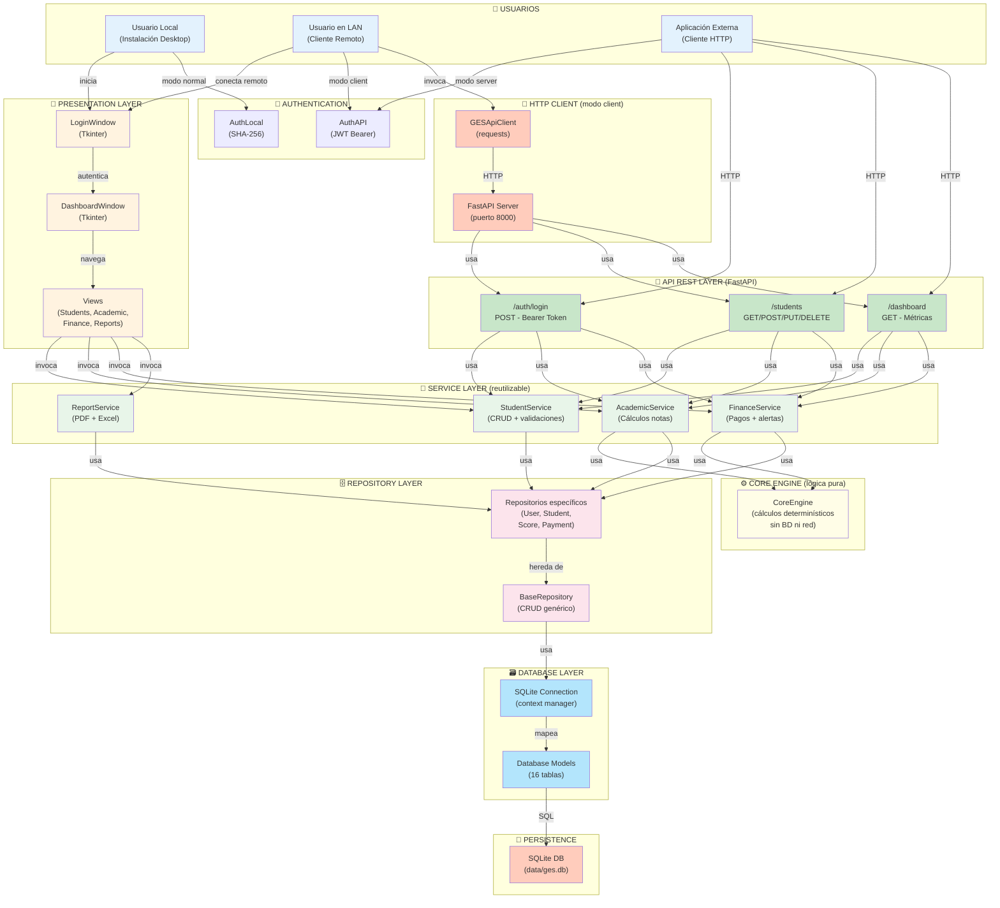
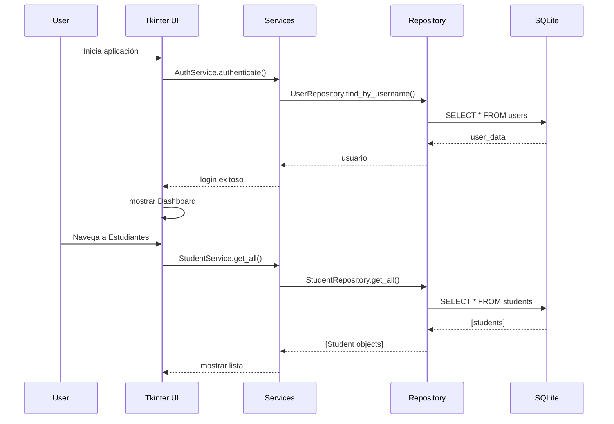
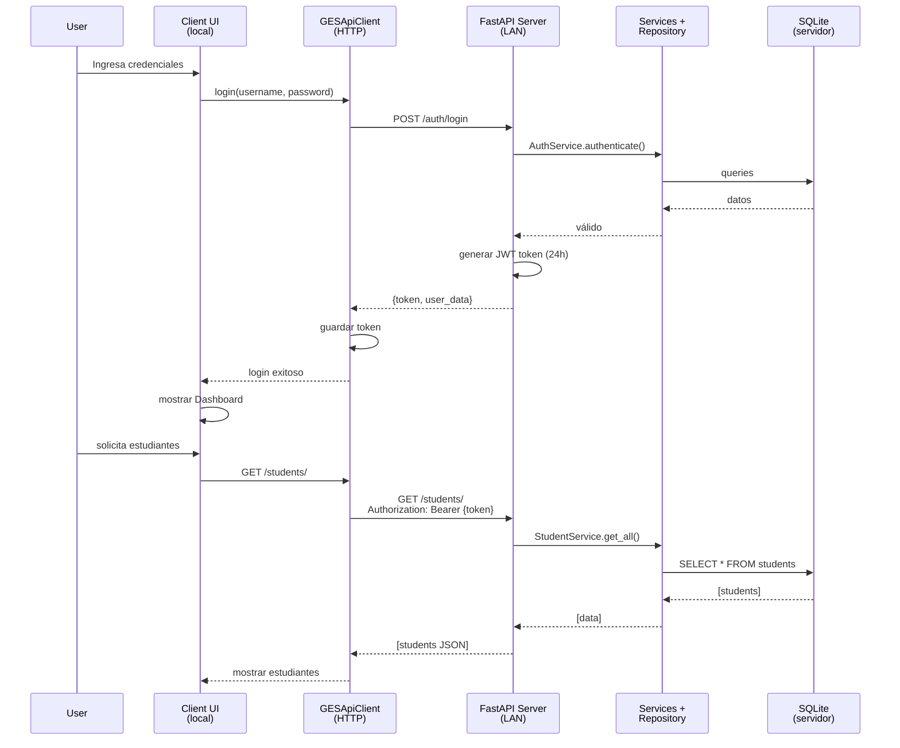
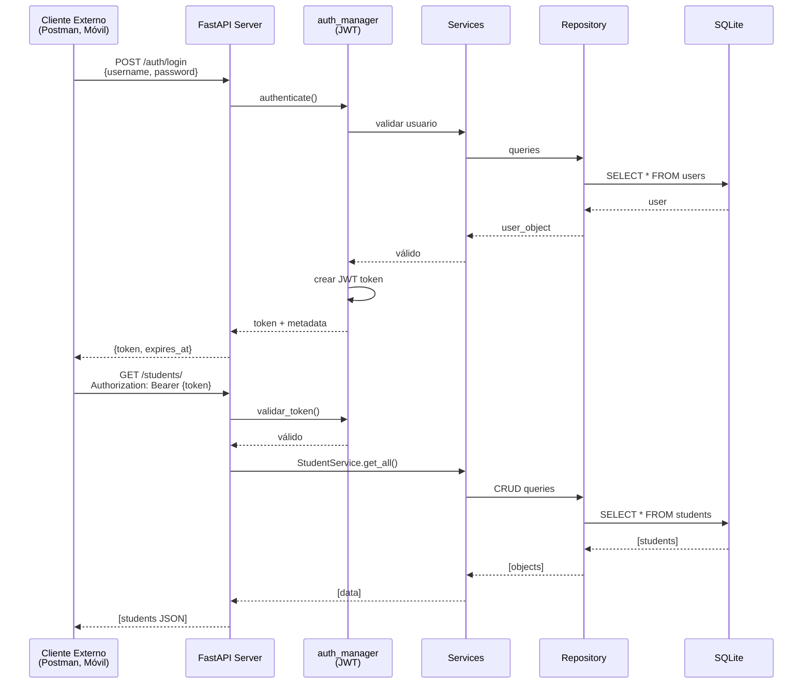
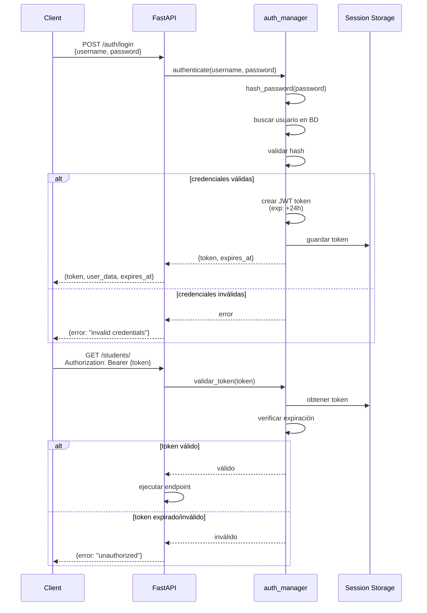
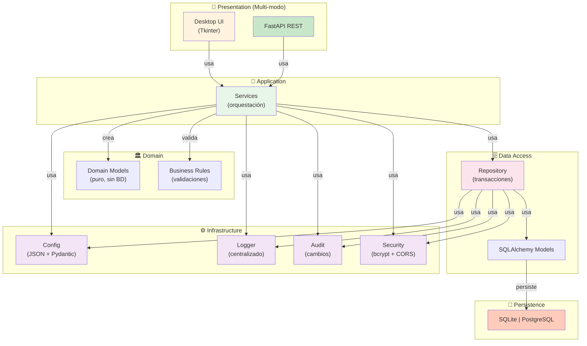

# 🏗️ ARQUITECTURA GES (Sistema de Gestión Escolar) - ACTUALIZADO v2.0

**Documento de Análisis Arquitectónico - Versión 2.0 (Arquitectura Híbrida)**  
**Generado:** Mayo 2026  
**Estado del Proyecto:** Refactorización completada - Multi-modo operativo  
**Análisis:** Basado en código real del proyecto

---

## 📋 Tabla de Contenidos

1. [Resumen Ejecutivo](#1-resumen-ejecutivo)
2. [Árbol Simplificado del Proyecto](#2-árbol-simplificado-del-proyecto)
3. [Diagrama Arquitectónico Principal](#3-diagrama-arquitectónico-principal)
4. [Flujos de Operación](#4-flujos-de-operación)
5. [Capas Identificadas](#5-capas-identificadas)
6. [Integraciones API REST](#6-integraciones-api-rest)
7. [Base de Datos](#7-base-de-datos)
8. [Relaciones Críticas](#8-relaciones-críticas)
9. [Riesgos Arquitectónicos](#9-riesgos-arquitectónicos)
10. [Propuestas de Mejora](#10-propuestas-de-mejora)

---

## 1. Resumen Ejecutivo

### 🎯 Tipo de Arquitectura Detectada

**Arquitectura Híbrida Multi-Modo: Desktop + API REST**

El proyecto soporta **3 modos de ejecución simultáneamente** sin código duplicado:

| Modo | Tipo | Punto Entrada | Uso |
|------|------|---------------|-----|
| **NORMAL** | Desktop Standalone | `main.py` → GESApplication | Instalación local sin red |
| **SERVER** | FastAPI REST | `api/server.py` (uvicorn) | Servidor LAN centralizado |
| **CLIENT** | Desktop + Remoto | `main.py` (GESApiClient) | Cliente conectado a servidor |

### 🛠️ Tecnologías Utilizadas

| Componente | Tecnología | Uso |
|-----------|-----------|-----|
| **GUI Desktop** | Tkinter (built-in) | Interfaz local |
| **Framework REST** | FastAPI | Servidor API |
| **Servidor ASGI** | Uvicorn | Ejecutor FastAPI |
| **Cliente HTTP** | requests | Modo client |
| **Base de Datos** | SQLite | Persistencia local |
| **Validación** | Pydantic | Esquemas API |
| **Reportes** | ReportLab | PDF generation |
| **Excel** | OpenPyXL | Importar/exportar |
| **Lenguaje** | Python | 3.10+ |

### 📐 Patrón Arquitectónico Principal

```
┌──────────────────────────────────────────────────────┐
│     Repository Pattern + Service Layer (reutilizable) │
│  Usado por: Desktop + API REST + Cliente Remoto       │
├──────────────────────────────────────────────────────┤
│  Capa UI    ← → Capa Services ← → Capa Repository     │
│  Desktop    ← → FastAPI/Client ← → SQLite Local       │
└──────────────────────────────────────────────────────┘
```

**Ventaja clave:** Un único código de Services y Repository usado por 3 entornos diferentes.

---

## 2. Árbol Simplificado del Proyecto

```
ges_proy/                                    ← Raíz del proyecto
│
├── 📄 main.py                              ← 🔴 PUNTO DE ENTRADA (Desktop/Client)
├── 📄 config.py                            ← Constantes (rutas, puertos)
├── 📄 config.json                          ← Configuración runtime (modo, IP, puerto)
│
├── 📁 api/                                 ← 🔴 API REST (FastAPI)
│   ├── server.py                           → Punto entrada FastAPI + middleware CORS
│   ├── auth_manager.py                     → Tokens JWT Bearer (24h TTL)
│   ├── routes_auth.py                      → POST /auth/login, /auth/logout
│   ├── routes_students.py                  → GET/POST /students/
│   ├── routes_dashboard.py                 → GET /dashboard/ (académico + financiero)
│   └── __init__.py
│
├── 📁 ui/                                  ← 🎨 INTERFAZ DE USUARIO (Tkinter)
│   ├── login.py                            → Ventana de login (local o remoto)
│   ├── dashboard.py                        → Panel principal
│   ├── students_view.py                    → CRUD estudiantes
│   ├── academic_view.py                    → Calificaciones
│   ├── academic_structure_view.py          → Grados, materias, aulas
│   ├── finance_view.py                     → Pagos y cuotas
│   ├── calendar_view.py                    → Calendario académico
│   ├── reports_view.py                     → Reportes PDF
│   ├── settings_view.py                    → Configuración
│   └── __init__.py
│
├── 📁 services/                            ← 💼 LÓGICA DE NEGOCIO (reutilizada)
│   ├── student_service.py                  → CRUD estudiantes + validaciones
│   ├── academic_service.py                 → Cálculos académicos + alertas
│   ├── finance_service.py                  → Pagos, cuotas, deuda + alertas
│   ├── report_service.py                   → Generación reportes (PDF, Excel)
│   ├── api_client.py                       → Cliente HTTP (para modo client)
│   └── __init__.py
│
├── 📁 database/                            ← 🗃️ ACCESO A DATOS
│   ├── models.py                           → Creación de tablas (DDL)
│   ├── repository.py                       → BaseRepository + CRUD genérico
│   ├── connection.py                       → Context manager SQLite
│   └── __init__.py
│
├── 📁 core/                                ← ⚙️ LÓGICA PURA (sin dependencias)
│   ├── engine.py                           → Cálculos académicos/financieros
│   │   ├── AcademicMetrics                 → Métricas académicas
│   │   ├── FinancialMetrics                → Métricas financieras
│   │   ├── calculate_student_average()     → Promedio trimestral
│   │   ├── generate_alert()                → Alertas
│   │   └── ...funciones puras
│   └── __init__.py
│
├── 📁 utils/                               ← 🔧 UTILIDADES
│   ├── helpers.py                          → Funciones compartidas
│   ├── excel_importer.py                   → Importar estudiantes
│   └── __init__.py
│
├── 📁 tests/                               ← ✅ PRUEBAS
│   ├── test_services_basic.py
│   ├── test_repository.py
│   ├── test_integration_basic.py
│   └── test_integration.py
│
├── 📁 data/                                ← 💾 PERSISTENCIA
│   └── ges.db                              → SQLite (archivo único)
│
├── 📁 docs/                                ← 📚 DOCUMENTACIÓN
│   └── arquitecture/                       → Análisis arquitectónico
│       └── ARQUITECTURA_GES.md             → Este archivo
│
├── 📁 app/                                 ← ⚠️ ESTRUCTURA HEREDADA (deprecada)
├── 📁 .venv/                               ← Entorno virtual
├── 📁 .git/                                ← Control versiones
└── requirements.txt                        ← Dependencias Python
```

---

## 3. Diagrama Arquitectónico Principal



---

## 4. Flujos de Operación

### 4.1 Modo NORMAL (Desktop Standalone)



### 4.2 Modo CLIENT (Remoto vía HTTP)



### 4.3 Modo SERVER (API Pura)



---

## 5. Capas Identificadas

### 5.1 Capa de Presentación (UI)

**Ubicación:** `ui/` (8 vistas principales - Tkinter)

| Componente | Responsabilidad |
|-----------|-----------------|
| **LoginWindow** | Autenticación (local o remota vía API) |
| **DashboardWindow** | Resumen, alertas, métricas |
| **StudentsView** | CRUD estudiantes, búsqueda |
| **AcademicView** | Calificaciones por trimestre |
| **AcademicStructureView** | Grados, materias, aulas |
| **FinanceView** | Pagos, cuotas, deuda |
| **CalendarView** | Calendario académico |
| **ReportsView** | Generación reportes PDF/Excel |
| **SettingsView** | Configuración del sistema |

---

### 5.2 Capa de Servicios (Lógica de Negocio)

**Ubicación:** `services/` (reutilizable por Desktop + API)

| Servicio | Responsabilidad |
|----------|-----------------|
| **StudentService** | CRUD + validaciones email/edad + búsqueda |
| **AcademicService** | Promedios, alertas rendimiento |
| **FinanceService** | Pagos, deuda, alertas morosidad |
| **ReportService** | Reportes PDF/Excel |
| **GESApiClient** | Cliente HTTP (modo client) |

**Características:**
- ✅ Orquestación de operaciones
- ✅ Validaciones de negocio
- ✅ Generación de alertas
- ✅ Reutilizable en Desktop + API REST

---

### 5.3 Core Engine (Lógica Pura)

**Ubicación:** `core/engine.py`

**Ventajas:**
- ⚙️ Sin dependencias externas (no importa BD, HTTP)
- ⚙️ Funciones matemáticas determinísticas
- ⚙️ Fácil testing unitario

**Componentes:**
```python
AcademicMetrics:
    - average: float
    - passed_subjects: int
    - failed_subjects: int
    - recovery_count: int

FinancialMetrics:
    - total_due: float
    - total_paid: float
    - outstanding: float
    - days_overdue: int

# Cálculos
- calculate_student_average(scores)
- generate_academic_alert(metrics)
- generate_financial_alert(metrics)
```

---

### 5.4 Capa de Repositorios (Acceso a Datos)

**Ubicación:** `database/repository.py`

**Patrón:** Repository genérico + específicos

```python
class BaseRepository:
    - create(model) → id
    - get(id) → object
    - get_all() → [objects]
    - update(id, data) → bool
    - delete(id) → bool

class UserRepository:
    - find_by_username(username) → User
    - authenticate(username, hash) → bool

class StudentRepository:
    - find_by_aula(aula_id) → [Student]
    - search(name, grade) → [Student]
    - is_enrolled(student_id, year_id) → bool
```

---

### 5.5 Capa de Base de Datos

**Ubicación:** `database/`

| Archivo | Responsabilidad |
|---------|-----------------|
| **models.py** | Creación DDL (16 tablas) |
| **repository.py** | CRUD + queries |
| **connection.py** | Context manager SQLite |

---

### 5.6 Capa de API REST

**Ubicación:** `api/` (FastAPI + Uvicorn)

| Componente | Responsabilidad |
|-----------|-----------------|
| **server.py** | Inicializa FastAPI + CORS + routers |
| **auth_manager.py** | JWT tokens (generar, validar, limpiar) |
| **routes_auth.py** | `/auth/login`, `/auth/logout` |
| **routes_students.py** | `/students/*` CRUD |
| **routes_dashboard.py** | `/dashboard/` métricas |

**Endpoints principales:**
```
POST   /auth/login              → {token, user_data, expires_at}
POST   /auth/logout             → {message}
GET    /students/               → [students]
GET    /students/{id}           → student_details
POST   /students/               → create_student
GET    /dashboard/              → {academic_metrics, financial_metrics}
GET    /health                  → {status, timestamp}
```

---

## 6. Integraciones API REST

### 6.1 Flujo de Autenticación JWT



### 6.2 Middleware CORS

```python
# api/server.py
app.add_middleware(
    CORSMiddleware,
    allow_origins=["*"],      # 🔥 ABIERTO (cambiar en producción)
    allow_credentials=True,
    allow_methods=["GET", "POST", "PUT", "DELETE"],
    allow_headers=["Content-Type", "Authorization"],
)
```

---

## 7. Base de Datos

### 7.1 Esquema de 16 Tablas

```sql
-- Estructura Escolar (4)
schools                 -- Información institucional
levels                  -- Primaria, Secundaria
grades                  -- Niveles (1ro, 2do, 3ro)
classrooms              -- Aulas específicas

-- Usuarios (2)
users                   -- Admin, Secretaria, Profesor
roles                   -- ADMIN, SECRETARY, TEACHER

-- Académica (3)
subjects                -- Materias
teachers                -- Profesores
scores                  -- Calificaciones (trimestre 1-3)

-- Financiera (4)
enrollment_prices       -- Costo por grado/año
payments                -- Pagos realizados
payment_calendars       -- Plan de pagos
payment_installments    -- Cada cuota individual

-- Sistema (3)
students                -- Estudiantes (estado: activo, retirado, graduado)
student_calendars       -- Calendario por estudiante
alerts                  -- Alertas generadas
```

### 7.2 Ubicación Física

```
data/
└── ges.db              ← SQLite archivo único
                        ← 16 tablas
                        ← Accesible: modo normal, server, client
```

---

## 8. Relaciones Críticas

### 8.1 Módulos Críticos (Sin estos = No funciona)

| Módulo | Razón | Fallo |
|--------|-------|-------|
| **database/connection.py** | Gestiona BD | ❌ No hay BD |
| **database/repository.py** | CRUD genérico | ❌ No se accede a datos |
| **config.py** | Constantes rutas | ❌ No hay rutas |
| **services/** | Lógica de negocio | ⚠️ Funcionalidad limitada |

### 8.2 Dependencias entre Capas

```
UI ↔ Services ← Repository ← Database
 ↑
 └─ FastAPI (cuando modo = "server" o "client")
```

### 8.3 Cuellos de Botella Potenciales

| Cuello | Impacto | Solución |
|--------|---------|----------|
| **SQLite monothread** | Múltiples clientes → lento | Migrar a PostgreSQL |
| **ReportLab PDF** | Reportes grandes lentos | Caché + async |
| **UI bloqueante** | Operaciones largas congelan | Threading |
| **JWT sin refresh** | Usuario desconectado 24h | Agregar refresh tokens |
| **CORS abierto** | Seguridad débil | Restricción IP |

---

## 9. Riesgos Arquitectónicos

### 🔴 CRÍTICOS

#### 1. Código Duplicado: `app/` vs Raíz

**Problema:**
```
├── app/domain/              ← DUPLICADO, DEPRECADO
├── app/repositories/        ← DUPLICADO, DEPRECADO
├── app/services/            ← DUPLICADO, DEPRECADO
├── app/ui/                  ← DUPLICADO, DEPRECADO

├── services/                ← ACTUAL (correcto)
├── database/repository.py   ← ACTUAL (correcto)
├── ui/                      ← ACTUAL (correcto)
```

**Impacto:** Confusión en qué código usar, mantenimiento duplicado

**Solución:** Eliminar `app/` completamente

---

#### 2. Configuración Hardcodeada

**Problema:**
```python
# En services/academic_service.py:
if average < 6.0:              # 🔥 Hardcodeado
    generate_alert(...)

# En services/finance_service.py:
if days_overdue > 30:          # 🔥 Hardcodeado
    generate_alert(...)
```

**Impacto:** Cambios requieren editar código + recompilar

**Solución:** Mover a `config.json` con schema validado

---

### 🟡 IMPORTANTES

#### 3. SHA-256 Débil para Contraseñas

**Problema:**
```python
# En ui/login.py:
hash = hashlib.sha256(password).hexdigest()  # 🔥 Sin salt, vulnerable
```

**Impacto:** Rainbow table attacks posibles

**Solución:** Usar bcrypt

---

#### 4. Sin Transacciones Explícitas

**Problema:**
```python
# Si falla aquí, datos inconsistentes:
payment = payment_repo.create(...)      # ✅
invoice = generate_invoice(...)         # ❌ Falla
```

**Impacto:** Matrículas sin cuotas, BD inconsistente

**Solución:** Context managers para transacciones

---

#### 5. CORS Abierto a Todos

**Problema:**
```python
# api/server.py:
allow_origins=["*"]  # 🔥 Cualquiera puede acceder
```

**Impacto:** Seguridad débil

**Solución:** Restricción a máquinas conocidas

---

### 🟢 MODERADOS

#### 6. Sin Logging/Auditoría

**Problema:** No hay registro de cambios

**Impacto:** Imposible investigar modificaciones

---

#### 7. UI Bloqueante

**Problema:** Operaciones largas congelan Tkinter

**Impacto:** Experiencia de usuario pobre

**Solución:** Threading

---

#### 8. Sin Validación en API

**Problema:** FastAPI acepta cualquier JSON

**Impacto:** Datos malformados en BD

**Solución:** Pydantic schemas

---

## 10. Propuestas de Mejora

### Fase 1: Limpieza Inmediata (1-2 horas)

1. **Eliminar `app/`** - Mantener solo raíz
2. **Consolidar config** - `config.json` con schema Pydantic
3. **Actualizar imports** - Todos apunten a estructura correcta

### Fase 2: Seguridad (2-3 horas)

4. **SHA-256 → bcrypt** - Proteger contraseñas
5. **CORS restringido** - Solo máquinas autorizadas
6. **Validación Pydantic** - Esquemas en API

### Fase 3: Robustez (3-4 horas)

7. **Transacciones explícitas** - ACID garantizado
8. **Logging centralizado** - Auditoría de cambios
9. **Threading en UI** - Operaciones sin bloqueo

### Propuesta: Arquitectura Mejorada



---

## 📊 Conclusiones

### ✅ Fortalezas Actuales

1. **Arquitectura Híbrida Única:** 3 modos sin código duplicado
2. **Separación Clara de Capas:** UI → Services → Repository → DB
3. **Reutilización Máxima:** Mismo código para Desktop + API + Client
4. **Core Engine Puro:** Lógica sin dependencias externas
5. **API REST Funcional:** FastAPI lista para múltiples clientes
6. **Configuración Flexible:** Modo configurable en runtime

### ⚠️ Mejoras Prioritarias

| Prioridad | Item | Tiempo | Beneficio |
|-----------|------|--------|-----------|
| 🔴 Alta | Eliminar `app/` | 30min | Claridad |
| 🔴 Alta | SHA-256 → bcrypt | 1h | Seguridad |
| 🟡 Media | CORS restringido | 30min | Seguridad |
| 🟡 Media | Pydantic schemas | 1.5h | Robustez |
| 🟡 Media | Transacciones | 2h | Consistencia |
| 🟢 Baja | Threading | 2h | UX |
| 🟢 Baja | Logging | 1h | Auditoría |

### 🎯 Recomendación

**La arquitectura es SÓLIDA y ESCALABLE.** El proyecto ha evolucionado correctamente hacia una estructura híbrida bien pensada.

**Acciones inmediatas (3 horas):**
1. Eliminar `app/` ✅
2. Agregar bcrypt ✅
3. Pydantic schemas ✅

Con esto, estará **production-ready**.

---

**Documento:** Mayo 2026  
**Versión:** 2.0 (Actualizado - Arquitectura Híbrida)  
**Estado:** ✅ Análisis Completo
